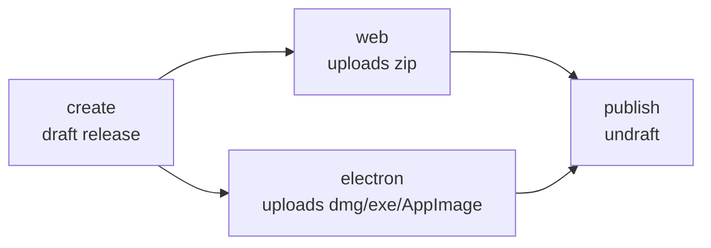

# CI and releases

Four workflows in `.github/workflows/`. Three of them build something; one of them owns the release
page and delegates to the others.

| Workflow          | File              | Purpose                                              |
|-------------------|-------------------|------------------------------------------------------|
| CI - Build and Test | `nextjs.yml`    | Unit tests, e2e tests (web + Electron), Next build   |
| Electron Build    | `electron.yml`    | Desktop installers for macOS, Windows, Linux         |
| Static Web Bundle | `web-static.yml`  | Self-hostable static site bundle                     |
| Release           | `release.yml`     | Creates the release page and gathers everyone's assets |

## What runs when

| Event                     | CI | Electron | Static web | Release |
|---------------------------|----|----------|------------|---------|
| Pull request              | x  |          |            |         |
| Push to any branch        | x  |          |            |         |
| Push to `main`            | x  | x        | x          |         |
| Push a `v*` tag           | x  | via Release | via Release | x    |
| Manual dispatch           | x  | x        | x          | x       |

Only `nextjs.yml` runs on every push and pull request, since it is the one that gates correctness.
The build workflows run on `main` so there is always a fresh downloadable artifact of the latest
commit. On a tag they do not trigger themselves; `release.yml` calls them, which is what keeps a tag
from building everything twice.

Every workflow cancels a superseded run on the same ref, except `release.yml` (see below).

## CI - Build and Test (`nextjs.yml`)

Single Ubuntu job: `pnpm test:run` (Vitest), then Playwright `--project=web` (headless Chromium,
exercises DuckDB WASM), then Playwright `--project=electron` under `xvfb-run` for the `*.shared.spec.ts`
specs, then `pnpm build`. The Electron step runs with `if: !cancelled()` so a web failure never hides
an Electron failure. The Playwright HTML report is uploaded as an artifact either way.

Note this also runs on tag pushes, because its `push` trigger has no branch filter. That is
deliberate enough to leave alone: cutting a release re-runs the full suite.

## Electron Build (`electron.yml`)

A three-way matrix with `fail-fast: false`, so one platform's failure does not cancel the others:

| Runner          | Flag      | Artifact             | File                     |
|-----------------|-----------|----------------------|--------------------------|
| `macos-latest`  | `--mac`   | `Dash-macOS-arm64`   | `dist-electron/*.dmg`    |
| `windows-latest`| `--win`   | `Dash-Windows-x64`   | `dist-electron/*.exe`    |
| `ubuntu-latest` | `--linux` | `Dash-Linux-x64`     | `dist-electron/*.AppImage` |

Runs `pnpm build` (the renderer) then `electron-builder <flag> --publish never`. There is no signing
certificate on CI, so `CSC_IDENTITY_AUTO_DISCOVERY=false` stops electron-builder looking for one, and
the outputs are unsigned. Checkout uses `fetch-depth: 0` because `next.config.mjs` derives the build
version from `git rev-list --count HEAD`.

## Static Web Bundle (`web-static.yml`)

Single Ubuntu job running `pnpm build:static`, which is `next build` plus `scripts/pack-web.mjs`.
Produces `dist-web/dash-web-<version>.zip` containing self-hosting instructions and a `site/` folder
to upload to any static host. See [self-hosting.md](self-hosting.md).

The workflow artifact is the *unpacked* bundle, so downloading it does not give you a zip inside a
zip. The `.zip` is what gets attached to a release.

## Release (`release.yml`)

Release creation and asset upload are deliberately separate. `release.yml` owns the release page;
each build workflow owns its own assets and knows nothing about creating releases. That way a new
builder can start attaching things to releases without touching release logic, and no two workflows
race to create the same release.



1. **`create`** rejects the run if the ref is not a tag, then checks the tag matches `package.json`
   (asset filenames come from `package.json`, so `v0.4.0` with version `0.3.0` would publish
   `dash-web-0.3.0.zip` under a `v0.4.0` release). It then creates the release as a **draft** with
   `--generate-notes`, or reuses it if it already exists.
2. **`web`** and **`electron`** run in parallel via `workflow_call`, each receiving `release_tag`.
   A reusable workflow always runs at the same commit as its caller, so they build the tag's code.
   Their last step is gated on `if: inputs.release_tag`, so it is skipped entirely on the normal
   `main` pushes. Each uploads with `gh release upload --clobber`; filenames are distinct per
   platform, so the four concurrent uploads do not collide, and a re-run overwrites rather than fails.
3. **`publish`** flips the draft to published. It has no `if: always()`, so a failed build leaves the
   release as a draft holding whatever did upload, ready to inspect and re-run instead of going out
   half-empty.

`cancel-in-progress` is `false` here so a release is never cancelled mid-upload.

### Cutting a release

```bash
# bump "version" in package.json first, and commit it
git tag v0.4.0
git push origin v0.4.0
```

Then watch the Release workflow. If a platform fails, fix it and re-run the workflow from the Actions
tab; the draft is reused and assets are overwritten. To retry from the UI, pick the tag in the ref
selector - dispatching on a branch is rejected by the first step.

### Adding another asset to releases

In the new build workflow:

```yaml
on:
  workflow_call:
    inputs:
      release_tag:
        type: string
        required: true

permissions:
  contents: write
```

plus a final step gated on `if: inputs.release_tag` that runs
`gh release upload "${{ inputs.release_tag }}" <files> --clobber`. On Windows runners set
`shell: bash` on that step, since pwsh does not expand globs for native commands. Then add a job to
`release.yml` with `needs: create`, `uses: ./.github/workflows/<file>.yml` and
`permissions: contents: write`, and add it to `publish`'s `needs`.
